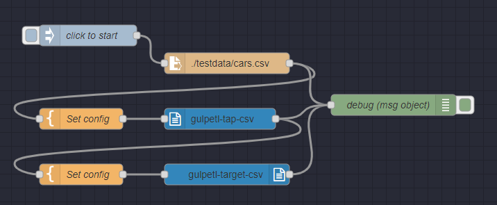

# gulp-etl-tap-csv

This plugin  converts CSV files to **gulp-etl** **Message Stream** files; originally adapted from the [gulp-etl-handlelines](https://github.com/gulpetl/gulp-etl-handlelines) model plugin. It is a **gulp-etl** wrapper for [csv-parse](https://csv.js.org/parse/).

This is a **[gulp-etl](http://gulpetl.com/)** plugin, and as such it is a [gulp](https://gulpjs.com/) plugin. **gulp-etl** plugins work with [jsonl](http://jsonlines.org/) data streams/files which we call **Message Streams** and which are compliant with the [Singer specification](https://github.com/singer-io/getting-started/blob/master/docs/SPEC.md#output). In the **gulp-etl** ecosystem, **taps** tap into an outside format or system (in this case, a CSV file) and convert their contents/output to a Message Stream, and **targets** convert/output Message Streams to an outside format or system. In this way, these modules can be stacked to convert from one format or system to another, either directly or with tranformations or other parsing in between. Message Streams look like this:

``` jsonl
{"type": "SCHEMA", "stream": "users", "key_properties": ["id"], "schema": {"required": ["id"], "type": "object", "properties": {"id": {"type": "integer"}}}}
{"type": "RECORD", "stream": "users", "record": {"id": 1, "name": "Chris"}}
{"type": "RECORD", "stream": "users", "record": {"id": 2, "name": "Mike"}}
{"type": "SCHEMA", "stream": "locations", "key_properties": ["id"], "schema": {"required": ["id"], "type": "object", "properties": {"id": {"type": "integer"}}}}
{"type": "RECORD", "stream": "locations", "record": {"id": 1, "name": "Philadelphia"}}
{"type": "STATE", "value": {"users": 2, "locations": 1}}
```

## Usage

**gulp-etl** plugins accept a configObj as the first parameter; the configObj
will contain any info the plugin needs. For this plugin the configObj is the "Options" object for [csv-parse](https://csv.js.org/parse/), described [here](https://csv.js.org/parse/options/); the only differences are around the [`columns`](https://csv.js.org/parse/options/columns/) option.

If its `columns` option is *false* `csv-parse` returns arrays for each row instead of objects, but the Singer spec [specifies objects](https://github.com/singer-io/getting-started/blob/master/docs/SPEC.md#record-message) ("JSON maps") for the `record` property. So, we default to *true* (which tries to auto-discover column names from first line, and returns lines as objects), and if you set `columns` to *false*, the arrays returned will be converted to objects: e.g. `["valueA", "valueB"]` becomes `{"0":"valueA", "1":"valueB"}`.

### Sample gulpfile.js

``` javascript

/* parse all .CSV files in a folder into Message Stream files in a different folder */

let gulp = require('gulp')
var rename = require('gulp-rename')
var tapCsv = require('gulp-etl-tap-csv').tapCsv

exports.default = function() {
    return gulp.src('data/*.csv')
    .pipe(tapCsv({ columns:true }))
    .pipe(gulp.dest('output/'));
}

```

### gulp-data
This plugin supports the use of the [gulp-data](https://github.com/colynb/gulp-data#readme) api for passing in its configObj parameter. This
allows data/options from the pipeline to be used to create options passed to this plugin when it runs. 

See the demonstration in `debug/gulpfile.ts` for usage examples.

### Node-RED ###
[Node-RED](https://nodered.org/) is a low-code, visual programming environment for event-driven applications. Install this node under Manage Palette, look for `gulp-etl-tap-csv`

#### Demo flow ####



This demo builds upon the more basic [demo flow](https://www.npmjs.com/package/gulp-etl-target-csv#demo-flow) for [gulp-etl-target-csv](https://github.com/gulpetl/gulp-etl-target-csv); here we'll use this plugin to parse a CSV file into gulp-etl's Message Stream format, and then use [gulp-etl-target-csv](https://github.com/gulpetl/gulp-etl-target-csv) ([npm](https://www.npmjs.com/package/gulp-etl-target-csv)) to convert it right back; a nice round trip. As you see, all of the nodes except gulp-etl-tap-csv and gulp-etl-target-csv are standard nodes that ship with Node-RED.

#### CSV data ####

For our demo, we'll save this CSV file to the `testdata` subfolder of our starting folder--which is where we ran node-red. Or we could just use a full path, which is actually recommended...

``` csv
carModel,price,color
"Audi",10000,"blue"
"BMW",15000,"red"
"Mercedes",20000,"yellow"
"Porsche",30000,"green"
```

#### Set config ####

The config is also set in a Template node. Identical to the `configObj` above, it is the "Options" object for [csv-parse](https://csv.js.org/parse/), described [here](https://csv.js.org/parse/options/), and you can set any of the properties described.


### Results

When we run, we'll watch the Debug console; we can see the data parsed into as Message Stream. This intermediate format is used by all gulp-etl plugins/nodes, and allows for smooth interactions between them all.

``` jsonl
{"type":"RECORD","stream":"cars","record":{"carModel":"Audi","price":"10000","color":"blue"}}
{"type":"RECORD","stream":"cars","record":{"carModel":"BMW","price":"15000","color":"red"}}
{"type":"RECORD","stream":"cars","record":{"carModel":"Mercedes","price":"20000","color":"yellow"}}
{"type":"RECORD","stream":"cars","record":{"carModel":"Porsche","price":"30000","color":"green"}}
```

And when it finishes, the data should be back in CSV format again!

### Flow code

Copy the demo flow for import in Node-RED under `Import`:

``` json
[{"id":"bd15ad43f5227ed0","type":"file in","z":"cd67672e19ab739a","name":"","filename":"./testdata/cars.csv","filenameType":"str","format":"utf8","chunk":false,"sendError":false,"encoding":"none","allProps":false,"x":330,"y"
:380,"wires":[["57240500756eadd1","bd4928a1fe33a509"]]},{"id":"5a22ef69893bbc79","type":"inject","z":"cd67672e19ab739a"
,"name":"click to start","props":[{"p":"payload"},{"p":"topic","vt":"str"}],"repeat":"","crontab":"","once":false
,"onceDelay":0.1,"topic":"","payload":"","payloadType":"date","x":130,"y":340,"wires":[["bd15ad43f5227ed0"]]},{"id"
:"7e1608b8b0ea106d","type":"gulpetl-target-csv","z":"cd67672e19ab739a","name":"","x":330,"y":540,"wires"
:[["bd4928a1fe33a509"]]},{"id":"16687292eb745dab","type":"template","z":"cd67672e19ab739a","name":"Set config","field"
:"config","fieldType":"msg","format":"json","syntax":"plain","template":"{\n    \"quoted\":false,\n    \"header\":true\n}",
"output":"json","x":120,"y":540,"wires":[["7e1608b8b0ea106d"]]},{"id":"5e5268849aacb118","type":"gulpetl-tap-csv","z"
:"cd67672e19ab739a","name":"","x":320,"y":460,"wires":[["16687292eb745dab","bd4928a1fe33a509"]]},{"id"
:"57240500756eadd1","type":"template","z":"cd67672e19ab739a","name":"Set config","field":"config","fieldType":"msg"
,"format":"json","syntax":"plain","template":"{\n    \"columns\":true\n}","output":"json","x":120,"y":460,"wires"
:[["5e5268849aacb118"]]},{"id":"bd4928a1fe33a509","type":"debug","z":"cd67672e19ab739a","name":"debug (msg object)"
,"active":true,"tosidebar":true,"console":false,"tostatus":false,"complete":"true","targetType":"full","statusVal":""
,"statusType":"auto","x":570,"y":440,"wires":[]}]
```

### Quick Start for Coding on This Plugin

* Dependencies:
* [git](https://git-scm.com/downloads)
* [nodejs](https://nodejs.org/en/download/releases/) - At least v6.3 (6.9 for Windows) required for TypeScript debugging
* npm (installs with Node)
* typescript - installed as a development dependency
* Clone this repo and run `npm install` to install npm packages
* Debug: with [VScode](https://code.visualstudio.com/download) use `Open Folder` to open the project folder, then hit F5 to debug. This runs without compiling to javascript using [ts-node](https://www.npmjs.com/package/ts-node)
<!-- * Test: `npm test` or `npm t`-->
* Compile to javascript: `npm run build`
<!--
### Testing

We are using [Jest](https://facebook.github.io/jest/docs/en/getting-started.html) for our testing. Each of our tests are in the `test` folder.

* Run `npm test` to run the test suites
-->
Note: This document is written in [Markdown](https://daringfireball.net/projects/markdown/). We like to use [Typora](https://typora.io/) and [Markdown Preview Plus](https://chrome.google.com/webstore/detail/markdown-preview-plus/febilkbfcbhebfnokafefeacimjdckgl?hl=en-US) for our Markdown work..
